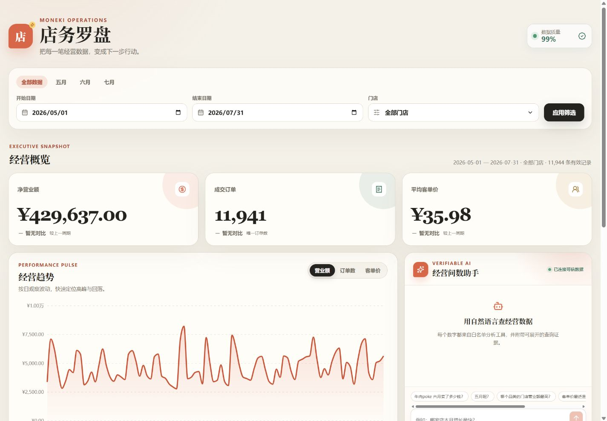
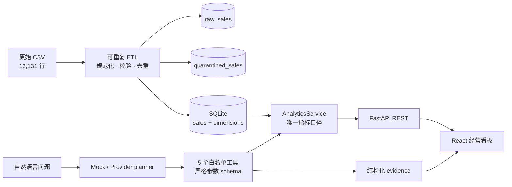

# 店务罗盘 · Moneki Operations Dashboard

一套面向连锁餐饮运营的全栈经营看板：将 12,131 行带有重复、缺失、格式差异和脏外键的 POS 流水，清洗为可审计的 SQLite 数据集，再通过 FastAPI、React 看板和可核验的 SSE 流式问答提供一致的经营数字。

> 核心原则：AI 只理解问题和选择白名单工具；金额、订单数、客单价与排行全部由同一个确定性分析服务计算，回答附带工具参数、结果和数据批次。



## 三步启动

```bash
# 下载或克隆仓库后进入项目目录
cd moneki-fullstack-dashboard
docker compose up --build
# 浏览器打开 http://localhost:8000
```

默认 `AI_MODE=mock`，不需要 API Key，也不会硬编码任何经营数字。首次构建会导入仓库内的 CSV；容器健康检查地址为 `http://localhost:8000/api/v1/health`。

## 为什么这份实现可信

- **数字只有一个来源**：看板 REST API 和 AI 工具都调用 `AnalyticsService`，不存在两套口径。
- **金额使用整数分**：数据库和计算过程不使用二进制浮点金额，避免累计误差。
- **外键必须 JOIN**：门店名、门店品类和商品名均由 `store_id` / `product_id` 关联维表取得。
- **原始数据不可变**：先保存原始销售行，再生成规范化销售表和隔离表。
- **脏数据不静默丢弃**：每个隔离行保留原始行号、原始字段和一个或多个原因码。
- **AI 不执行自由 SQL**：只允许五个经过 schema 校验的分析工具；不支持的问题明确拒答。
- **可回归验证**：后端、组件、类型、生产构建和桌面/手机双视口端到端测试覆盖核心链路，并由 GitHub Actions 重复执行。

## 已实现功能

### 经营看板

- 日期快捷范围、自定义起止日期和门店筛选
- 净营业额、唯一订单数、客单价，以及同长度上一周期变化
- 营业额 / 订单数 / 客单价日趋势切换
- Top 10 商品、销量、营业额与唯一订单数
- 五家门店营业额、占比和地区对比
- 加载骨架、API 错误重试、无数据状态、响应式布局和键盘可访问控件

### 可信 AI 问数

- 支持题目要求的三个问题及“那五月呢？”上下文追问
- 每个数值回答展示白名单工具名、规范化参数、返回值、数据批次与生成时间
- “应用到看板”会同步日期、门店筛选并高亮对应商品
- 默认 Mock planner；可选 OpenAI-compatible provider planner
- 最近 8 条消息作为有界上下文，请求失败可原问题重试
- `POST /api/v1/chat/stream` 使用真实 HTTP/SSE 分段传输；前端边接收边显示，支持停止和新问题取消旧请求
- 对天气、库存等数据集外问题返回 `unsupported`，不生成伪造数字

### 数据质量账本

| 阶段 | 行数 | 处理 |
|---|---:|---|
| 原始 POS 行 | 12,131 | 原样写入 `raw_sales` |
| 完全重复 | 76 | 保留首次出现，移除重复副本 |
| 去重后待校验 | 12,055 | 日期、ID、金额与外键规范化 |
| 安全补全金额 | 119 | 仅在商品、数量和单价均可信时使用 `qty × unit_price` |
| 唯一隔离行 | 111 | 保存原始行号、内容与全部原因 |
| 最终有效销售行 | 11,944 | 只允许这些行进入经营指标 |

详细规则、问题重叠与复核 SQL 见 [数据质量说明](docs/DATA_QUALITY.md)。

## 指标口径

| 指标 | 定义 |
|---|---|
| 净营业额 | 有效销售行的 `SUM(amount_cents)` |
| 订单数 | `COUNT(DISTINCT order_id)`，不是销售行数 |
| 客单价 | 净营业额 ÷ 唯一订单数；没有订单时返回 `null` |
| Top 商品 | JOIN 商品维表后按净营业额降序，同额按商品 ID 稳定排序 |
| 门店对比 | JOIN 门店维表后按门店聚合，计算全选范围内营业额占比 |
| 日期边界 | `start_date`、`end_date` 均包含在筛选范围内 |
| 上一周期 | 与当前区间天数相同、紧邻当前区间之前的日期范围 |

当前完整数据区间为 2026-05-01 至 2026-07-31：净营业额 **¥429,637.00**、唯一订单 **11,941**、客单价 **¥35.98**。这些值由真实数据库构建后读取，不写入应用逻辑。

## 架构



### 技术选型

| 层 | 选择 | 理由 |
|---|---|---|
| 数据处理 | Pandas + Python | 对约 1.2 万行 CSV 足够快，规则可读、易写边界测试 |
| 数据库 | SQLite + SQLAlchemy | 零外部依赖、一键启动，同时保留事务与明确 schema |
| 后端 | FastAPI + Pydantic | 自动 OpenAPI、严格输入输出合同、依赖注入便于测试 |
| 前端 | React + TypeScript + TanStack Query | 类型化 API、稳定缓存键、请求取消和明确异步状态 |
| 可视化 | Recharts | 响应式 SVG、tooltip 和多指标切换实现简洁 |
| 测试 | Pytest + Vitest + Playwright | 从函数、合同、组件到真实浏览器形成测试金字塔 |
| 交付 | 单镜像 Docker + GitHub Actions | 一个端口运行完整前后端，CI 重现全部检查 |

## 本地开发

需要 Python 3.11+ 与 Node.js 22+。

```bash
# 1. 后端环境与依赖
python -m venv .venv
# Windows: .venv\Scripts\activate
# macOS/Linux: source .venv/bin/activate
python -m pip install -e "./backend[dev]"

# 2. 前端依赖
cd frontend
npm ci
cd ..

# 3. 两个终端分别启动
python -m uvicorn app.main:app --app-dir backend --reload --port 8000
cd frontend && npm run dev
```

开发地址为 `http://localhost:5173`，Vite 会将 `/api` 代理到 `http://127.0.0.1:8000`。如果 `var/moneki.db` 不存在，首次 API 请求会原子化构建数据库。

手动重建数据库：

```bash
python -m app.etl.cli --data-dir data --database var/moneki.db
```

## AI 模式

### 默认：确定性 Mock planner

```dotenv
AI_MODE=mock
```

Mock 只将有限的自然语言意图映射到工具参数；工具仍实时查询 SQLite，所以数据库变化时回答随之变化。

默认公开部署也使用该模式：它是“数据库规则分析”，不是伪装成在线大模型的逐 token 输出。回答文本通过真实 SSE 网络事件分段到达，但每个经营数值仍来自同一套确定性查询。

### 可选：OpenAI-compatible provider

```dotenv
AI_MODE=provider
AI_API_KEY=your-key
AI_BASE_URL=https://api.openai.com/v1
AI_MODEL=gpt-5.4-mini
```

Provider 仍然只能选择下列工具，无法读 CSV、无法执行任意 SQL：

- `get_revenue`
- `get_top_entities`
- `compare_periods`
- `get_trend`
- `get_data_quality`

未配置 Key 时自动使用 Mock，不影响全部必需功能。完整开发过程和 AI 边界见 [AI_USAGE.md](AI_USAGE.md)。

## API

| 方法 | 路径 | 用途 |
|---|---|---|
| GET | `/api/v1/health` | 服务与数据库健康状态 |
| GET | `/api/v1/meta` | 日期范围、门店和快捷筛选 |
| GET | `/api/v1/dashboard` | 一次返回 KPI、趋势、商品与门店对比 |
| GET | `/api/v1/data-quality` | 导入摘要、规则和问题计数 |
| POST | `/api/v1/chat` | 有界上下文、回答、evidence 和看板动作 |
| POST | `/api/v1/chat/stream` | SSE 流式状态、增量回答、最终 evidence 和看板动作 |
| GET | `/docs` | FastAPI OpenAPI 交互文档 |

示例：

```bash
curl "http://localhost:8000/api/v1/dashboard?start_date=2026-06-01&end_date=2026-06-30"
curl -X POST "http://localhost:8000/api/v1/chat" \
  -H "Content-Type: application/json" \
  -d '{"message":"牛肉poke 六月卖了多少钱？","history":[]}'

curl -N -X POST "http://localhost:8000/api/v1/chat/stream" \
  -H "Content-Type: application/json" \
  -d '{"message":"牛肉poke 六月卖了多少钱？","history":[]}'
```

流式事件顺序为 `start → status → delta* → result → done`。请求校验错误在开始传输前返回标准 HTTP 4xx；传输开始后的异常使用 `error` 事件。

## Render 部署

仓库根目录的 `render.yaml` 定义单个免费 Docker Web Service。Render 从同一镜像构建 React、导入 CSV、启动 FastAPI，并通过 `/api/v1/health` 检查 SQLite 是否可用。平台注入的 `PORT` 会被容器启动命令和健康检查共同读取，本地未设置时回退到 `8000`。

免费实例闲置后可能休眠，首次访问需要等待冷启动；业务数据由镜像内不可变 CSV 重建，因此不依赖持久磁盘。线上默认 `AI_MODE=mock`，不需要也不保存 API Key。

## 测试与质量门禁

```bash
# 后端：ETL、金额、JOIN、指标、错误合同、AI 证据、SPA
python -m pytest backend/tests -q

# 前端：格式化、看板交互、AI 证据与重试
cd frontend
npm test -- --run
npm run typecheck
npm run build

# 真实 Chromium：桌面 + Pixel 7
npx playwright install chromium
npm run test:e2e
```

CI 对每次 push / pull request 自动执行上述检查并构建 Docker 镜像。端到端测试覆盖：加载 KPI、门店筛选、数据质量抽屉、AI 必问题、证据展开与图表联动。

## 项目结构

```text
backend/app/
  etl/          CSV 解析、规范化、校验、隔离与原子导入
  db/           SQLAlchemy schema 与连接
  analytics/    唯一经营指标查询层
  ai/           planner、白名单工具、证据与回答
  api/          FastAPI 路由与类型合同
frontend/src/
  features/dashboard/   看板、筛选、图表、排行与质量抽屉
  features/chat/        AI 会话、证据卡与看板动作
data/                   题目提供的不可变 CSV
docs/                   数据规则、设计规格、实施计划与截图
```

## 设计取舍

- 本题数据量不需要微服务、外部数据仓库或向量数据库；这些会增加启动成本而不增加数字可信度。
- 对无法确定业务含义的符号冲突不猜测为退款，统一隔离并保留审计信息。
- 使用真实 SSE 传输状态与回答分片，同时明确标识“数据库规则分析”；传输形态不会改变最终结构化 evidence，也不会被宣传为大模型 token 流。
- 原始作业说明保留在 Git 历史首个提交中；本实现对应的设计与逐任务计划保留在 `docs/superpowers/`。

## 进一步阅读

- [DEMO.md](DEMO.md)：固定演示脚本、真实答案与验证方式
- [AI_USAGE.md](AI_USAGE.md)：AI 协作记录、真实错误和人工决策
- [docs/DATA_QUALITY.md](docs/DATA_QUALITY.md)：逐条清洗规则与审计口径
- [原始作业仓库](https://github.com/MorrisPRC/moneki-fullstack-assignment)
