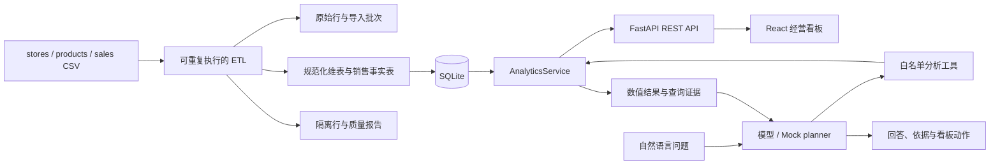

# Moneki 门店经营看板与可信 AI 问答设计规格

日期：2026-08-19  
状态：已在对话中确认，等待书面规格复核

## 1. 目标

在 24 小时作业约束下，交付一个可本地一键运行、可部署、可验证数字来源的餐饮经营看板。系统必须完成基础数据看板和 AI 数据问答，并通过自动化测试证明看板与 AI 使用同一套真实查询结果。

成功标准：

- 三步内启动完整系统，默认无需外部数据库。
- 日期筛选能够返回每日营业额、唯一订单数、客单价和 Top 10 商品。
- 所有业务维度通过 `store_id`、`product_id` JOIN 获得，不复制或猜测维表信息。
- AI 对数值问题必须先调用受控查询工具，回答附带结构化证据。
- 无 API Key 时，Mock 仅负责选择工具和参数，数字仍来自 SQLite。
- 清洗规则、影响行数、隔离原因和指标口径都有文档与测试。
- 前端包含加载、空状态、错误状态、响应式布局和基础无障碍支持。
- 仓库包含 README、AI_USAGE、DEMO、架构图、测试和连续 Git 提交历史。

## 2. 非目标

本作业不实现用户登录、权限系统、数据编辑 CRUD、多租户、微服务、消息队列、向量数据库、任意 SQL 生成或 Kubernetes。它们不会提升题目核心评分，且会削弱交付质量。

## 3. 技术选型

- 前端：React、TypeScript、Vite、Tailwind CSS、TanStack Query、Recharts。
- 后端：FastAPI、Pydantic、SQLAlchemy。
- 导入与清洗：Pandas，仅用于 ETL，不在每次请求中读取 CSV。
- 数据库：SQLite；金额以整数分存储，日期以 ISO `YYYY-MM-DD` 存储。
- AI：供应商适配接口、JSON Schema 工具调用、可替换的真实模型与确定性 Mock planner。
- 测试：pytest、Vitest、Playwright 单条核心冒烟流程。
- 运行：开发期前后端独立热更新；生产期由 FastAPI 提供 Vite 构建产物；单 Docker 镜像部署。

该组合保留清晰的前后端边界，又避免两套部署和外部数据库造成的时间风险。

## 4. 系统架构



`AnalyticsService` 是唯一业务口径来源。REST 看板接口和 AI 工具都只能通过该服务查询，禁止在路由、前端或 prompt 中重复实现指标计算。

## 5. 目标仓库结构

```text
backend/
  app/
    api/              # dashboard、chat、quality、health 路由
    ai/               # provider、planner、tools、evidence
    analytics/        # 唯一业务查询服务
    db/               # schema、连接与导入
    etl/              # 解析、规范化、校验与质量统计
    models/           # Pydantic 输入输出模型
  tests/
frontend/
  src/
    api/
    components/
    features/dashboard/
    features/chat/
    hooks/
    lib/
    test/
data/                 # 题目原始 CSV，不修改
docs/superpowers/     # 设计规格与实施计划
Dockerfile
docker-compose.yml
README.md
AI_USAGE.md
DEMO.md
```

## 6. 数据导入与清洗规则

原始数据概况：5 家门店、20 个商品、12,131 条销售行，日期覆盖 2026-05-01 至 2026-07-31。

ETL 按固定顺序执行，并保存每一步的输入、输出和原因计数：

1. 保存原始行号和原始字段，不修改 `data/` 下的源文件。
2. 删除 76 条完全重复的额外记录，保留首次出现的原始行。
3. 日期按三个明确格式解析：`YYYY-MM-DD`、`DD-MM-YYYY`、`YYYY/MM/DD`；统一保存为 ISO 日期。不能匹配这些格式的行隔离。
4. 对外键执行 `trim`，因此 `S01 ` 归一为 `S01`。
5. 金额去除 `¥` 前缀后转成整数分；当前数据中有 40 行带该前缀。
6. 缺失金额共 120 行。当商品存在、数量为正且单价有效时，以 `qty × unit_price` 补全并记录 `amount_source=imputed`；当前有 119 行满足条件。其余行隔离。
7. 当前数据不存在“数量和金额同时为负”的一致退款记录；49 行正数量负金额、14 行负数量正金额、11 行零数量非零金额均属于符号冲突，隔离而不擅自解释为退款。
8. 未知门店 `S99` 和未知商品 `P99` 无法可靠 JOIN，隔离并记录 `unknown_store` 或 `unknown_product`。一行可包含多个质量原因，但最终隔离行只计一次。
9. 对剩余行校验 `amount == qty × unit_price`。不一致且无法由已声明规则解释的行隔离，禁止静默覆盖原金额。
10. 数据质量报告同时提供原始问题计数、去重后问题计数、最终有效行数和唯一隔离行数，避免原因重叠造成误导。

数据库至少包含：

- `ingestion_runs`：文件摘要、导入时间、规则版本和统计。
- `raw_sales`：原始销售行。
- `stores`、`products`：规范化维表。
- `sales`：通过校验的事实表，含 `amount_cents`、`amount_source`。
- `quarantined_sales`：原始行号、原始值和 JSON 原因列表。

`sales(date)`、`sales(store_id)`、`sales(product_id)` 和常用组合过滤建立索引。

## 7. 业务指标口径

- 营业额：有效销售行 `SUM(amount_cents)`。
- 订单数：`COUNT(DISTINCT order_id)`，绝不按销售行计数。
- 客单价：营业额除以唯一订单数；无订单时为 `null`，不返回无穷或 NaN。
- Top 商品：JOIN 商品维表后按营业额降序，营业额相同则按商品 ID 稳定排序。
- 门店对比：JOIN 门店维表后按门店聚合。
- 日期过滤：开始和结束日期都包含在内。
- 上一周期：取与当前筛选区间相同天数、紧邻当前区间之前的日期范围。
- 百分比变化：上一周期为零时返回 `null` 并附带 `no_baseline`，不伪造百分比。

后端返回整数分和已格式化展示值；前端不得以浮点数重新计算核心指标。

## 8. API 设计

### `GET /api/v1/health`

返回服务状态、数据库状态和当前导入批次。

### `GET /api/v1/meta`

返回数据日期范围、门店筛选项、商品筛选项和预设日期区间。

### `GET /api/v1/dashboard`

参数：`start_date`、`end_date`、可选 `store_id`。一次返回：

- `filters`：后端实际采用的筛选条件。
- `summary`：营业额、订单数、客单价和上一周期变化。
- `daily`：按日营业额、订单数、客单价。
- `top_products`：Top 10 商品。
- `store_comparison`：门店营业额和占比。
- `coverage`：有效行数、日期覆盖和数据更新时间。

### `GET /api/v1/data-quality`

返回导入统计、规则说明、问题计数和隔离摘要，不暴露敏感环境变量。

### `POST /api/v1/chat`

输入为当前消息和最近有限条上下文；输出为：

- `answer`：简洁自然语言回答。
- `evidence[]`：工具名、规范化参数、确定性数值、数据库批次和查询时间。
- `dashboard_action`：可选日期、门店、商品高亮动作。
- `status`：`answered`、`unsupported` 或 `unavailable`。
- `suggestions`：无法回答时给出系统支持的问题示例。

日期反转、范围外、未知实体、空结果和过长输入分别返回明确的 4xx 错误或可解释业务状态。

## 9. AI 可信问答

AI 不接触 CSV 文件，也不执行自由 SQL。只开放以下工具：

- `get_revenue(start_date, end_date, product_name?, store_id?, store_category?)`
- `get_top_entities(dimension, metric, start_date, end_date, limit)`
- `compare_periods(metric, current_start, current_end, previous_start, previous_end, filters?)`
- `get_trend(metric, start_date, end_date, granularity, filters?)`
- `get_data_quality()`

工具参数使用严格 schema 校验，日期和实体由后端再次验证。数值问题必须产生至少一个工具调用；模型不得从历史文本复制旧数字作为新答案。

真实模型与 Mock 共享同一 `Planner` 接口：

- 真实模型负责从自然语言选择工具并基于工具结果组织回答。
- Mock 根据有限意图和实体规则生成相同的工具调用对象，不硬编码数据库数值。
- 若没有 API Key，默认切到 Mock 并在 UI、README、AI_USAGE 中明确标识。
- 对不在数据中的问题返回能力边界和建议，不编造答案。

上下文追问通过客户端传递最近消息和上一轮结构化工具参数实现。例如“那五月呢？”会继承上一轮商品与指标，仅修改日期。服务器不需要账户或长期会话存储。

## 10. 前端体验

产品名为“店务罗盘”。视觉使用暖白背景、深炭文字、橙红强调色，避免默认紫色渐变和组件库样板感。

页面结构：

1. 顶部品牌、数据更新时间、数据质量状态和筛选器。
2. 营业额、订单数、客单价三张 KPI 卡，显示上一周期变化。
3. 营业额趋势主图，可切换营业额、订单数、客单价。
4. Top 10 商品与门店对比区域。
5. AI 助手区域，含示例问题、流式状态、回答、证据卡和“应用到看板”。
6. 数据质量抽屉，解释被修复和隔离的数据。

所有数据区域包含 skeleton、空状态、重试和错误说明。图表具备文本替代信息、可读 tooltip 和非纯颜色区分。窄屏改为单列，AI 面板变为底部抽屉。

## 11. 错误处理与安全边界

- 配置只从环境变量读取，提交 `.env.example`，禁止提交密钥。
- AI 请求设置输入长度、超时和异常兜底；AI 故障不能影响看板 API。
- 所有 SQL 参数化；AI 工具只能调用固定服务方法。
- 开发环境允许明确的本地 CORS 来源；生产由同源单容器提供服务。
- ETL 使用事务和临时数据库文件，成功后原子替换，避免半导入状态。
- 启动时若数据库不存在或源文件变化则导入；请求过程中不重复读取 CSV。

## 12. 测试策略

### ETL 单元测试

- 三种日期格式。
- 带 `¥` 金额、缺失金额补全、金额转整数分。
- 外键 trim、重复行、未知外键和符号冲突。
- 多个质量原因只产生一条隔离记录。

### 分析服务测试

- 唯一订单计数而非行数。
- 客单价、Top 10、门店 JOIN、商品 JOIN、日期边界。
- 上一周期和零基线。
- 使用真实题目数据生成稳定快照，并对关键查询保留直接 SQL 交叉验证。

### AI 合同测试

- Mock planner 产生合法工具参数。
- “哪个品类的门店营业额最高？”结果等于数据库查询。
- “牛肉poke 六月卖了多少钱？”结果等于 dashboard/analytics 结果。
- “客单价最近是涨了还是跌了？”比较结果与服务一致。
- “那五月呢？”继承正确上下文。
- 数据外问题返回 `unsupported`，没有伪造数值。

测试比较 `evidence` 中的结构化数值，不通过解析自然语言答案来判断正确性。

### 前端与端到端测试

- 组件级覆盖筛选、格式化、空状态和错误状态。
- 一条 Playwright 冒烟流程覆盖：打开页面、修改日期、看图表、提问、展开证据、应用看板联动。

CI 至少运行后端测试、前端测试、类型检查和生产构建。

## 13. 文档与演示

README 提供三步内运行方法、架构图、技术选型、指标口径、数据清洗摘要、测试命令、AI 模式和部署链接。

`AI_USAGE.md` 如实记录：

- 使用的 AI 工具和任务拆分方式。
- 一个真实 prompt。
- AI 曾产生的错误或数字幻觉、发现方式和修复方式。
- 哪些关键口径由开发者决定以及原因。

`DEMO.md` 固定展示三个题目问题、一个上下文追问和一个无法回答的问题，并说明如何从 evidence 和数据库测试验证数字。

## 14. 实施阶段与提交边界

1. 工程骨架、依赖与 Docker。
2. ETL 测试、实现、数据库 schema 和质量报告。
3. AnalyticsService 测试与实现。
4. Dashboard API 与契约测试。
5. React 看板及状态处理。
6. AI 工具链、Mock、证据和合同测试。
7. 上下文、看板联动和核心端到端测试。
8. UI 打磨、性能、无障碍和响应式。
9. README、AI_USAGE、DEMO、部署和最终验收。

每个阶段至少一个语义明确的提交，禁止把全部实现压成单个 `finish` 提交。

## 15. 完成验收

- 全新环境可以按 README 三步内打开系统。
- Docker 构建成功，生产容器健康检查通过。
- 后端测试、前端测试、类型检查和生产构建全部通过。
- 三个必问题、上下文追问、无答案问题均现场通过。
- 看板与 AI 对相同过滤条件返回相同结构化数值。
- 所有数据问题在质量报告中可追溯到规则和原始行。
- UI 在桌面和移动宽度下无横向溢出或关键内容遮挡。
- 仓库无密钥、无生成缓存、无未说明的硬编码答案。
